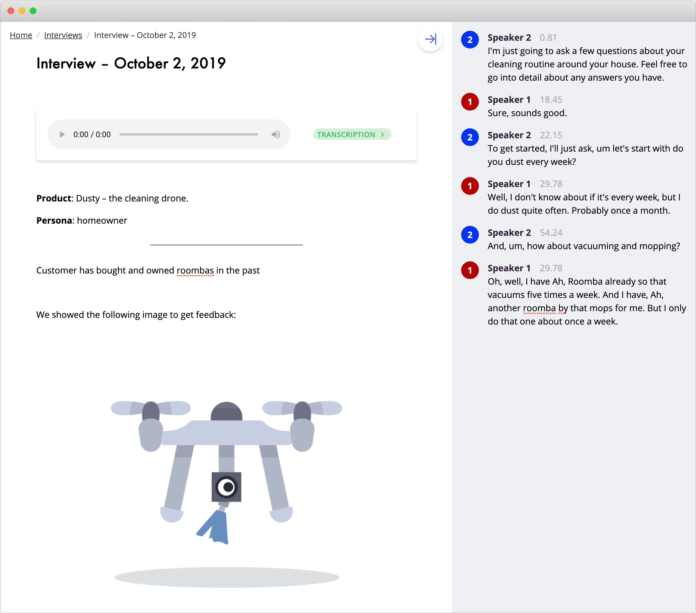
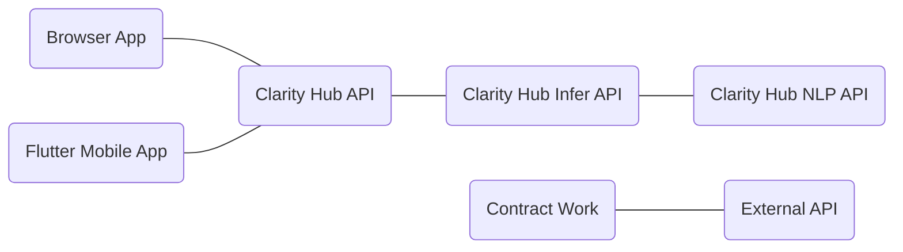
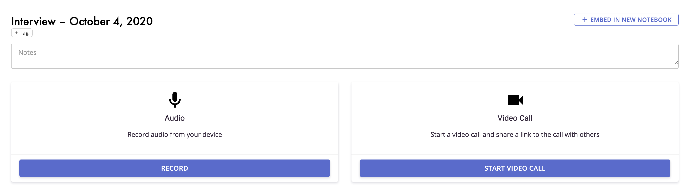
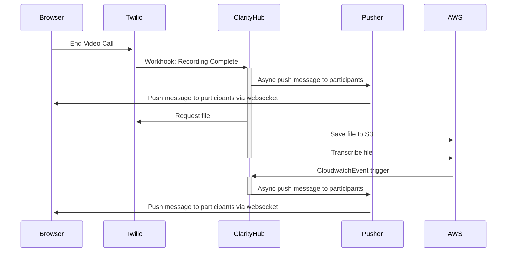
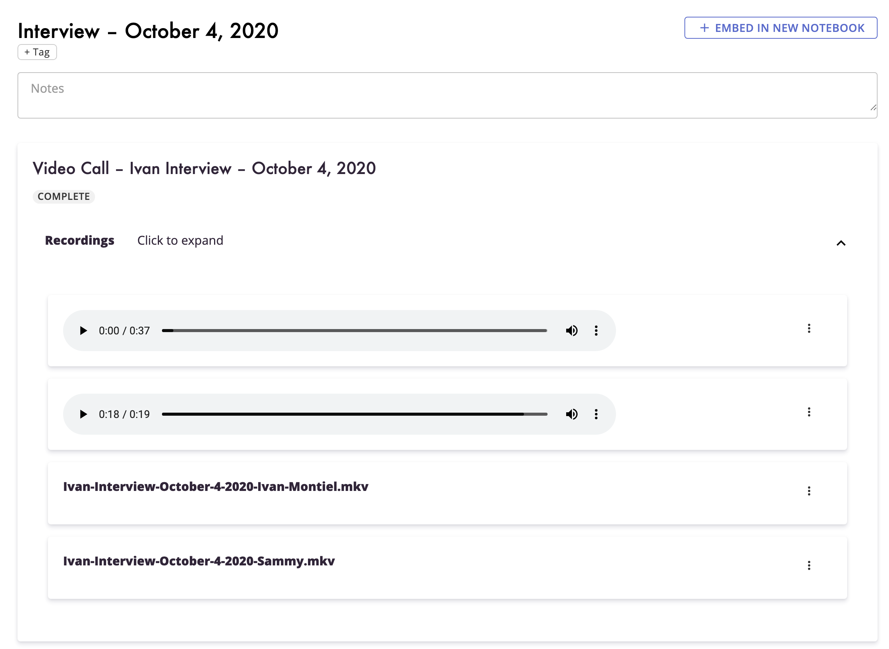
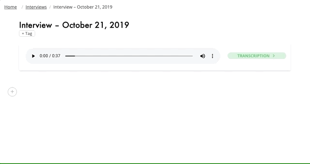
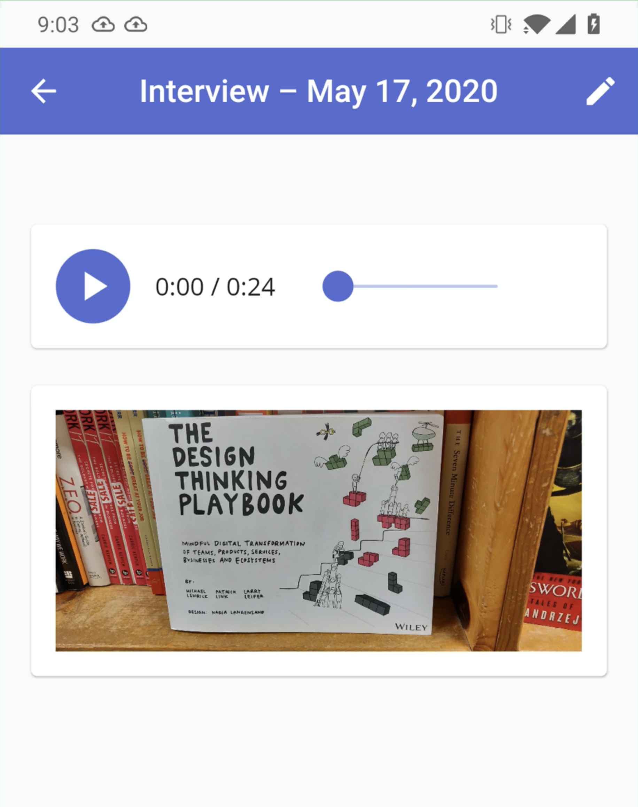
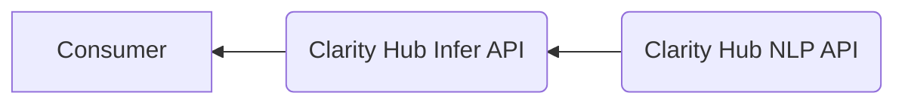
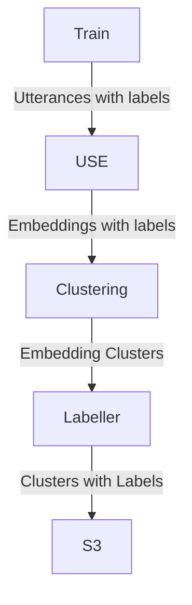
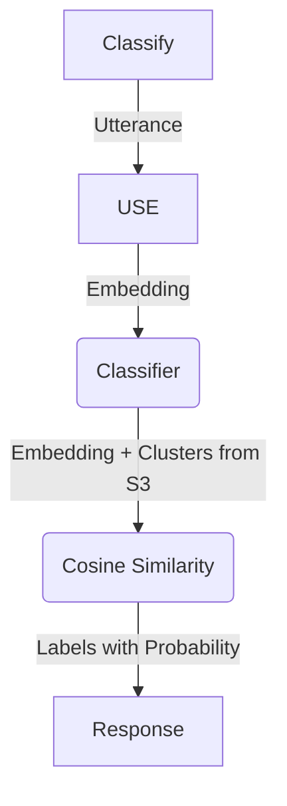

# Clarity Hub Architecture

# 1. Introduction

## 1.1 The main idea

I had quit my job and wanted to create my own startup from the ground up. One area I saw that could be improved was around how product and design teams would conduct user research and then try to piece it all together into something sensible that they could share with their teams.

I talked with a product owner and their workflow looked something like this:

1. They would reach out to a customer or potential customer and do a short customer interview - asking questions, showing mocks, and getting feedback. This would get recorded as a video or audio file.
2. They would also take notes on Google Docs at the same time.
3. Afterwords, they would add some more notes to the Doc, upload the audio file to Google Drive, and then link it in the doc.
4. Then they would share out the document with the team. The team would use Google Doc comments to add their thoughts on anything.

After that, the doc would just sit there. No one would look at it, reference it, or even know how to find it again.

I had recently played with two new apps that I really liked: [Otter.ai](http://Otter.ai) and [Notion.so](http://Notion.so) . The idea with Clarity Hub was: let’s add some structure and AI on top of the product research experience.

Let Product Owners, Designers, and Engineers do what they do well and give them a platform so that these customer interview sessions and brainstorming meetings continue to give value even after they are done.

## 1.2 The requirements

Clarity Hub needed to have a few key features in order to meet our goals:

1. Record audio and video customer interviews.
2. Transcribe and understand the audio.
3. Rich note taking features.
4. Comments and discussions.
5. Easily search and reference all of these pieces of data in one place.

Some technical requirements:

1. Keep costs low since this was mainly a self-funded effort.
2. Front-end in React since that is what the team knew.
3. Make the stack as easy to develop and deploy as possible.

## 1.3 The product

Clarity Hub offered users Workspaces where they can create Notebooks full of rich-text notes including headings, images, file uploads, embedded audio and video recordings (via Interviews), and other embedding other notebooks.

We offered transcribing for audio recordings, and those transcriptions could be edited to fix any transcribing issues, and could be pull-quoted into the notebook.

Users could also create video calls and invite interview participants to those calls via magic links. Those video calls would be recorded and transcribed as well.

We also offered a mobile app with a subset of these features - mainly being able to record and upload audio, take notes, and embed photos in Notebooks.

## 2. Implementation

Clarity Hub was split into a few codebases: A React browser application, a Flutter Android and iOS application, a NodeJS Clarity Hub API, and a NodeJS/Python NLP API. There was also a clone of the Clarity Hub API made for external contract work that slimmed down authentication and workspace features to make it easier to work with.

The Clarity Hub API and NLP API were deployed using Serverless to AWS and relied on DynamoDB and other AWS services to power them.

The Browser App was deploying to S3 and served via Cloudfront as a Single Page App. Other parts of the Clarity Hub site like marketing pages, blogs, and docs were statically generated pages using Gatsby and deployed in a similar manner using S3 and Cloudfront.

Part of the infrastructure was managed using Terraform, but any services and roles needed by the Serverless deployments were managed by Serverless resources (which uses CloudFormation under the hood).

## 2.1. Audio and video transcribing

Audio and video transcribing was accomplished using the AWS Transcribe service.

For audio recording, we used the native recording APIs for the browser and microphone APIs for mobile devices.

For video recordings, we leveraged Twilio’s APIs to create an in-app video calling experience.

Here is an example sequence diagram of what happens when a video call is completed:

Note: each request from the ClarityHub part of the sequence usually results in three things being updated:

1. The VideoCall and Media database records are updated with their current state
2. A Log is sent to Firehose for analytics
3. A Usage database record is saved to update the customers plan usage

The user from the UI will see the call end, any other users connected will see the embedded video call widget in the interviews and notebooks get updated to a completed state, and then will see that widget get updated with a linked transcription and links to download the recorded files.

Another note: Twilio at the time did not provide transcription quality that we found acceptable, so we would download, re-upload the media to S3, and then use the AWS Transcribe service instead.

## 2.2. Rich text editor

We used [Slate](https://docs.slatejs.org/libraries/slate-react) as our rich text editor and React for the UI. Slate offers a way to embed React components as part of the text that users can edit, similar to [Notion.so](http://Notion.so). This made it easy to let users create Notebooks, which could embed Interviews. An Interview might be an audio or video recording with a transcript. A Notebook can have notes, embed images and files, and even embed Interviews.

Slate also works based on changesets, which helps enable collaborative editing. We only experimented with this feature, but changesets are built into the UI React codebase. Only the latest snapshot of the editor is saved to the database.

## 2.3. Workspaces and notebooks

Multi-tenancy is managed in Clarity Hub using workspaces. When a user logs into Clarity Hub via Auth0, they are then asked to log into a Workspace (or create one if this is their first time logging in). Once a Workspace is selected, the user is issued a new JWT that authenticates that user for that specific Workspace.

Workspaces, notebooks, and most of the rest of the application are simple CRUD stores which read and write to DynamoDB.

## 2.4. Mobile

The iOS and Android apps for Clarity Hub were written in Flutter using a Redux style architecture for loading, storing, and rendering content. The original version of this application was written via contract work, which is why the simplified External API was created.

The mobile application can record audio using `flutter_sound_lite` package, and allowed users to upload and view files, take notes, and manage interviews. 

## 2.5. Experimental NLP

The NLP part of Clarity Hub was still experimental. While we exposed the NLP endpoints via a public API that anyone could use to train and infer labels, we did not release automatic labelling in the product.

The NLP APIs at Clarity Hub were a set of APIs:

The Consumer would user the Infer API which provided APIs for training and labeling datasets and getting toxicity and sentiment analyses. the Clarity Hub NLP API contained trained Tensorflow datasets for creating embeddings via the Universal Sentence Encoder (USE).

An **embedding** a vector that represents an utterance - a sentence, sentence fragment, or paragraph of text.

Training would involve a consumer sending a payload of utterances with labels to the Infer API, which would call the NLP API internally to create embeddings. We then clustered these embeddings to and re-labelled the clusters using the given labels. If no label was found for an utterance cluster, we attempted to pull a topic out of the utterances to re-label it.

The clusters with labels were then stored into S3.

To classify a new utterance, we created an embedding from it, loaded the existing dataset in, then ran cosine similarity to find the most probabilistic matches:

In Clarity Hub’s UI, we trained our internal dataset off of notebooks that had tags on them, and then would suggest tags for new sentences and notebooks.

## 2.6. All the other stuff

The rest of the application leveraged external services heavily to get functionality out the door.

We used Auth0 for managing different authentication methods. We used JWKS to validate the JWT that Auth0 provided us, then exchanged that JWT for one signed by our services.

For billing, we leveraged Stripe to create and manage plans and users in a workspace.

AWS SES was used for simple emails, and the Mailchimp API was used for newsletters and any email requiring a nicer looking template.

We used Gatbsy to create static sites for our marketing pages, docs, and blogs.

We leveraged AWS Firehose for logging which we stored an S3 Bucket. We wired that bucket up to Amazon Quicksight to create analytic dashboards to monitor number of users, interviews created, how many minutes of audio we had transcribed and more.

# 3. Development

Clarity Hub development was built upon Serverless for easily managing our endpoints and being able to deploy them to AWS. Anything that Serverless couldn’t manage, we used Terraform to manage instead. This included Route53, S3 buckets, and Cloudfront for our websites.

Local development used Docker, Docker Compose, and Serverless Offline for developers to spin up all of some of the services necessary to test and create new features.

## 3.1. Open source

We ended up creating https://github.com/clarityhub/serverless-dynamodb-migrations to support our workflow of DynamoDB + Serverless deployment. We also made contributions to the serverless ecosystem with PRs for [serverless-offline](https://github.com/dherault/serverless-offline/pull/337) and [serverless-offline-sns](https://github.com/mj1618/serverless-offline-sns/pull/22).

# 4. Limitations

The limitations of using DynamoDB are mainly around scalability and cost. It is not easy to scale up and down depending on usage and the cost can quickly become prohibitive if usage grows.  Additionally, its query capabilities are limited and you must carefully design the schema to ensure efficient retrievals. The reason we chose DynamoDB was to save around cost. 

We had to be mindful of the cost of running our application and so we chose to use serverless technology and AWS to keep our costs low. This allowed us to quickly spin up and down resources on-demand and allowed us to focus on development instead of management. We also took advantage of open source technologies such as Terraform and Docker to ensure we could easily deploy and manage our application on AWS.

If ClarityHub had continued to grow, we most likely would have done two things as we onboarded more customers and scaled:

- Migrated some data and schemas from DynamoDB to PostgreSQL
- Migrated some workloads to EC2 instances instead of Lambdas

# 5. Summary

Clarity Hub was designed to help product and design teams to conduct user research. By leveraging existing technologies such as Twilio, AWS Transcribe, and Slate, we were able to create a platform that was both powerful and cost-effective. We also took advantage of open source technologies such as Terraform and Docker to ensure we could easily deploy and manage our application on AWS. In the future, we may need to consider migrating some data and schemas to PostgreSQL and some workloads to EC2 instances if ClarityHub continues to grow.
